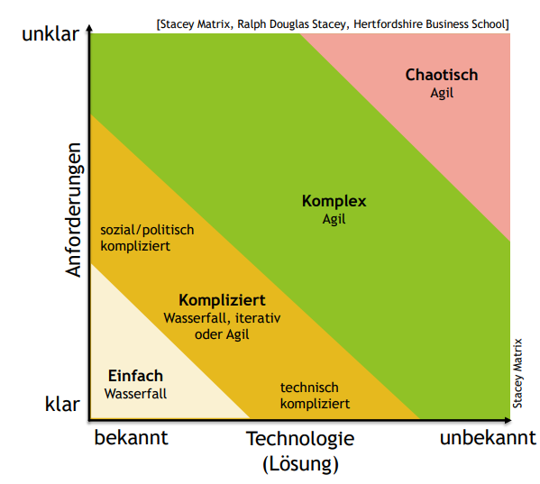

# Agiles Requirements Engineering :dizzy_face:
## Lernziele
### Sie kennen den Zweck agiler Methoden und wann man sie am erfolgreichsten einsetzen kann.
- Wozu sind agile Methoden gut?
    - Unter Unsicherheit handlungsfähig bleiben und überhaupt vorwärts kommen (wo man mit klassischen Methoden nicht weiterkommt).
    - Gut ans Ziel kommen (bei Software-Projekten bedeutet „gut“ in hoher Qualität und ohne kritische Bugs). Probleme früh erkennen und schnell lösen.
    - Ans richtige Ziel kommen, d.h. genau das bauen, was die Stakeholder*innen wirklich brauchen. Nur Dinge machen, die auch wirklich benötigt werden.
    - Nicht unbedingt, um schneller zu werden.
    - Entscheidung nach Stacey-Matrix 
    
### Sie wissen, dass auch in agilen Projekten Requirements Engineering ein Schlüsselfaktor ist und Anforderungen professionell ermittelt, dokumentiert, geprüft und abgearbeitet werden müssen.
Yes
### Sie kennen die wesentlichen Artefakte und Elemente im agilen Requirements Engineering, wie Backlog, Story Map, Epics und User Stories und MVP.
- Das **Product Backlog** ist eine vollständige Liste aller Sachen, die wir aktuell wissen, die noch zu tun sind.
- Eine **Story Map** ist eine Visualisierungstechnik für das Backlog.
- **Epics** werden eingesetzt um mehrere Stories zusammenzufassen (Epics tragen oft Wert für die Stakeholder\*innen, z.Bsp. einen Anwendungsfall)
- **User Stories** erzählen, wie die Benutzer\*innen die Funktionen des Systems verwenden, um etwas Wertvolles zu erreichen (Wer? Was? Wozu?).
- **MVP** - Minimum Valuable Product

### Sie kennen wesentliche Prinzipien und Methoden des agilen Requirements Engineerings.
1. Anforderungen auswählen aus dem Backlog
2. Anforderungen verfeinern (Refinement Meeting (PO und Devs))
3. Product Increment erstellen (neu Version, Prototypes, Design Thinking)
4. Product Increment prüfen und validieren (Feedback einholen, Demos, Review, Probebetrieb)
5. Feedback in den Backlog einfließen lassen
Repeat -> Profit

### Sie kennen den zentralen Stellenwert von Feedback in agilen Methoden und können regelmäßiges Feedback zu Anforderungen methodisch einholen.
- Unter Unsicherheit ist es wichtig, Dinge einfach und mit wenig Risiko ausprobieren zu können und schnell und häufig Feedback zu erhalten, ob es richtig ist oder nicht.
- Für Anforderungsreviews muss man in agilen Projekten nicht warten, bis die Anforderungsdokumente fertig sind.
- Zeitpunkte:
    - Vor der Implementierung: Feedback in Anforderungsreviews holen
    - Während der Implementierung: Feedback mit Prototypen holen
    - Nach der Implementierung: Review Meeting am Ende der Iteration
    - Nach dem Go-Live: Feedback direkt im Feld holen

### Sie kennen die zentralen Rollen und deren Verantwortlichkeiten im agilen Requirements Engineering.
- Stakeholder\*innen
    - Liefern Ideen, Wünsche, Anforderungen
    - Setzen Rahmenbedingungen
- Product Owner\*in (PO)
    - Verantwortlich für die Anforderungen
    - Schnittstelle zwischen Stakeholder\*innen und Entwicklungsteam
- Entwicklungsteam
    - Verantwortlich für die Lösung
    -  Schätzt Aufwände und legt fest, wieviel in einer Iteration gemacht wird
-  Agile Coach (z.B. Scrum Master\*in)
    - Verantwortlich für den agilen Prozess

