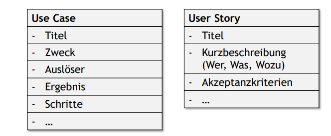
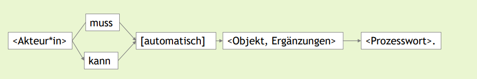

# Anforderungen gut dokumentieren :sob:
## Lernziele
### Sie wissen, worum es beim Dokumentieren von Anforderungen geht.
- Alle ermittelten Anforderungen müssen dokumentiert, d.h. langfristig gespeichert werden.
- Die Summe aller Dokumente und Artefakte, die Anforderungen und weitere im Requirements Engineering relevante Informationen enthalten, nennt man Anforderungsspezifikation.

### Sie kennen wesentliche Gründe und den Nutzen einer guten Anforderungsspezifikation.
- Wissen über die Anforderungen konservieren
- Wissen zu den Anforderungen verteilen und kommunizieren
- Wissen zu Anforderungen während des Schreibens erarbeiten
- Gesetzliche oder vertragliche Verpflichtungen erfüllen
- Ich kann nachweisen, dass etwas so besprochen wurde bzw. dass sich die Stakeholder*innen es so gewünscht haben, wie ich es gebaut habe.
- Ich kann wo nachschauen, wenn ich in zwei Jahren bei einer Änderung wissen möchte, warum etwas ist wie es ist und ob ich es einfach umprogrammieren kann.

### Sie wissen, wie man Anforderungsspezifikationen strukturieren kann.
- In Literatur und Wissenschaft gibt es zahlreiche Standards für den Aufbau von Anforderungsspezifikationen (IEEE 830, ISO/IEC/IEEE 29148, ISO 25065:2019)
- In der Praxis passt man die Struktur fast immer an die eigenen Bedürfnisse an.
- Die Inhalte können auf mehrere Artefakte (z.B. Dokumente, Tickets, BacklogItems, Wiki-Seiten) aufgeteilt sein.
- Best Practices:
    - **Klarer Zweck**: Werde Dir klar, wozu Du das Dokument erstellst.
    - **Empfängerorientiert:** Werde Dir klar, für wen Du schreibst, und passe Inhalt und Sprache an.
    - **Titel:** Jedes Dokument bekommt einen sprechenden Titel.
    - **Autor\*innen:** Nenne die Autor*innen.
    - **Standard einhalten:** Wenn Du Dokumentvorlagen verwendest, halte Dich an die Struktur
    - **Inhaltsverzeichnis:** Wenn das Dokument länger als fünf Seiten ist, füge ein Inhaltsverzeichnis ein.
    - **Einfacher Schriftstil:** Nicht mehr als zwei verschiedene Fonts und drei Font Sizes, ggf. noch fett.
    - **Kurz:** Schreibst du für andere, bleibe unter zehn Seiten. Schreibst du für dich, tob dich aus.

#### Struktur einzelner Anforderungen
- Auch für die Beschreibung einzelner Anforderungen (also eine Funktion, eine Eigenschaft) innerhalb der Anforderungsspezifikation gibt es Struktur-Templates. 

- Eine Anforderung = ein Satz vermeidet Scheinkomplexität
- Klassische Satzschablone:

### Sie kennen Vor- und Nachteile textueller/natürlichsprachiger und modellbasierter Dokumentation.
#### Textuell/Natürlichsprachig
**Vorteile:**
- Keine Notationskenntnis erforderlich - alle Stakeholder können den Text ohne spezielle Schulung verstehen
- Die Sprache ist vielseitig einsetzbar für verschiedene Arten von Anforderungen
- Requirements Engineers können damit alle Arten von Anforderungen und Perspektiven ausdrücken
**Nachteile:**
- Übersichtlichkeit bei komplexeren Zusammenhängen oft schwer erreichbar

#### Anforderungsmodelle (z.B. Systemkontextmodell, Use Cases, ...):
**Vorteile:**
- Kompaktere Darstellung als natürlichsprachige Formulierungen
- Detaillierte Modelle lassen wenig Spielraum für Interpretationen (eindeutiger)
**Nachteile:**
- Leser\*in der Modelle müssen die jeweilige Notation erst lernen und beherrschen
- Modelle sind nicht universell einsetzbar für alle Arten von Anforderungen

### Sie kennen die wichtigsten Anforderungsmodelle.
- Systemkontext-Diagramm
- Ablauf BPMN Prozessmodell
- Daten: UML Klassendiagramm
- UI-Mockup

### Sie kennen Qualitätskriterien für gut dokumentierte Anforderungen.
1. Verständlich
2. Eindeutig
3. Vollständig
4. Konsistent
5. Korrekt
6. Bewertet
7. Verfolgbar

### Sie wissen, worauf man achten muss, um Anforderungen verständlich und eindeutig zu formulieren.
- **einfach**: bekannte Begriffe, einfache Sprache
- **geordnet**: logische Gliederung
- **kurz**: nur relevante Informationen
- **anschaulich**: Beispiele und Modelle zur Veranschaulichung
- Smells, wenn erkannt, ausbessern:
    - Universalquantoren
    - Schwammige Substantive 
    - Nominalisierung und Passiv
    - Mehrdeutige Adjektive und Adverbien