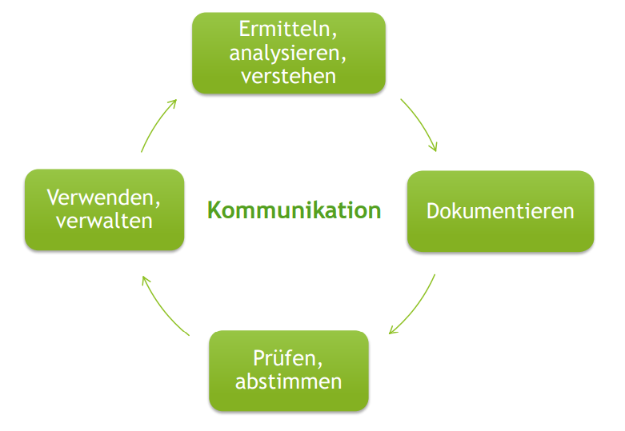

# Grundlagen :vomiting_face:

## Lernziele:
### Sie wissen, was Requirements Engineering ist.

- *Requirements Engineering ist ein iterativer, inkrementeller Prozess mit dem Ziel alle Anforderungen der relevanten Stakeholder\*innen so detailliert zu erarbeiten, dass das Entwicklungsteam alles hat, was es als Input braucht, um die richtige Software entwerfen und bauen zu können.*
- Alle Anforderungen sind konform zu den Dokumentationsvorschriften dokumentiert.
- Die Kernfrage im RE ist: Was muss das System können? Was brauchen die Stakeholder*innen?

### Sie kennen die wichtigsten Grundbegriffe im Requirements Engineering.

- **Requirements Engineering** *siehe erste Frage*
- Die **Anforderungsspezifikation** ist die Summe aller Artefakte,die die Anforderungen und weitere im Requirements Engineeringerarbeitete Informationen enthalten. → Ergebnis des RE
- Die\*der **Architekt\*in** „erfindet“ (konzipiert, designed) dieLösung, also das Produkt.
- Ergebnis der Architekturarbeit ist die **Systemspezifikation** →Kernfragen sind: Wie schaut das Produkt aus? Wie erfüllen wir dieAnforderungen? Wie bauen wir das Produkt? Wie funktioniert estechnisch im Inneren? → nicht mehr Aufgabe des RE
- Ein\*e **Stakeholder\*in** im Requirements-Engineering ist einePerson oder Organisation, die ein berechtigtes Interesse am Projekthat und dessen Verlauf oder Ergebnis direkt oder indirektbeeinflusst oder davon beeinflusst wird.     

### Sie kennen die Arten von Anforderungen.
- Eine Anforderung ist eine von einer\*einem Stakeholder\*ingeforderte Funktion oder Eigenschaft, die ein System erfüllen muss, um ein Problem zu lösen oder ein Ziel zu erreichen.
- Jede Anforderung muss enthalten
    - **Wer**? (Stakeholder\*in)
    - braucht **Was**? (Funktion oder Eigenschaft)
    - **Wozu**? (zu lösendes Problem bzw. zu erreichendes Ziel)
- Es gibt:
    - Funktionale Anforderungen
    - Qualitätsanforderungen (oft als nicht-funktional bezeichnet)
    - Rahmenbedingungen (oft als nicht-funktional bezeichnet)

#### Funktionale Anforderungen
- Eine funktionale Anforderung definiert eine vom System
bereitzustellende Funktion.
    - Funktionen
        - automatisierte oder manuell angestoßene
        - bereitgestellte Services, ...)
    - Regeln und Verhalten
        - Ereignisse, deren Auslöser und die gewünschte Reaktion des Systems bzw. der Anwender\*innen darauf
        -  Berechnungsregeln, Entscheidungsregeln, Prüfregeln, ...
    - Struktur
        - Datenstrukturen
        - UI-Struktur
        - Struktur der APIs nach außen
- Legen Funktionalität fest, d.h. das WAS?
- Es werden nur die von außen wahrnehmbaren Funktionen, Struktur und Verhalten betrachtet. (kein Innnenleben)
- Bsp.: *„Bei Absage eines Marathons muss das System alle angemeldeten Läufer*innen informieren.“*

#### Qualitätsanforderungen
- Eine Qualitätsanforderung (Qualitätsmerkmal) definiert eine qualitative Eigenschaft, die das System oder einzelne Funktionen aufweisen muss.
    - Leistung (Performance)
    - Sicherheit
    - Zuverlässigkeit
    - Verfügbarkeit
- Qualitätsanforderungen definieren, was für die\*den Auftraggeber\*in „Qualität“
bedeutet und in welchem Niveau diese die Software erfüllen muss.
- Sie können sich auf das ganze System oder einzelne Funktionen beziehen und beeinflussen Architektur und Gestalt der Lösung.
- Bsp.: *„Das System muss in der Lage sein, jeder*jedem Läufer*in alle 10 Sekunden ein Statusupdate zu senden.“*

#### Rahmenbedingungen
- Eine Rahmenbedingung ist eine Vorgabe, die die Art und Weise einschränkt, wie das betrachtete System realisiert werden kann.
    - Technologische Vorgaben
    - Regulatorische Vorgaben
    - Organisatorische Vorgaben
- Rahmenbedingungen sind bereits getroffene Entscheidungen für die Lösung, die von den Beteiligten nicht beeinflusst werden kann.
- Sie beziehen sich entweder auf das zu realisierende System oder auf den Entwicklungsprozess.
- Bsp.: *„Das Projekt muss nach ISO/EN 9973 umgesetzt werden.“*
    
### Sie kennen das Zusammenspiel von Anforderungen und Lösung.
- Anforderung → WAS? (Bsp.: Am Bankomat darf nur ich von meinem Konto abheben können, damit ich nicht bestohlen werde.)
- Lösung → WIE? (Bsp.: Sicherung mit PIN-Abfrage vor jeder Abhebung)
- Anforderungen und Lösung sind in der Praxis oft miteinander verzahnt und können nicht völlig unabhängig betrachtet und verfeinert werden.
- Oft muss man Lösungsentscheidungen treffen, um mit den Anforderungen
weiterzukommen.
- Vor jeder weiteren Verfeinerung oder jedem größeren Schritt auf der
Anforderungsseite ist zu prüfen, ob das technisch so umsetzbar ist. → Risikomanagement

### Sie kennen die Hauptaufgaben im Requirements Engineering.

- **Ermitteln:** Anforderungen von Stakeholder*innen und anderen Quellen bekommen
- **Dokumentieren:** Persistieren der Anforderungen in Form von Texten, Tabellen, Modellen, Prototypen etc.
- **Prüfen:** Sicherstellen, dass das, was man sich in den Anforderungen überlegt hat, auch tatsächlich das Problem löst (=Validieren). Sicherstellen, dass Anforderungen für alle Stakeholder\*innen passen. Prüfen, ob die Qualität der Anforderungen
schon so gut ist, dass man damit in die Umsetzung gehen kann (=Verifizieren).
- **Verwenden**: Während der Umsetzung der Lösung werden praktisch bei allen Aktivitäten Anforderungen verwendet. Dazu gehören Tätigkeiten wie Aufwandsschätzung, Priorisierung, Versionierung, Planung, Architektur, Testen, ...
- Bei diesem iterativen Prozess ist Kommunikation sehr wichtig. Requirements Engineering ist ein People Business :exploding_head: .

### Sie kennen die Rolle der\*des Requirements Engineers\*in.
- Es ist eine zentrale Rolle an der Schnittstelle zwischen Business und IT, die wesentlich zum Projekterfolg beiträgt, indem sie für klare und von allen verstandene Anforderungen sorgt.
- Die Rolle beeinhalte vielseitige Aufgaben:
    - Ermitteln und Analysieren von Anforderungen
    - Dokumentieren der Anforderungen
    - Prüfen und Abstimmen der Anforderungen mit allen Beteiligten
    - Verwenden und Verwalten der Anforderungen im Projektverlauf
- In der Praxis muss "Requirements Engineer\*in" keine eigenständige Position im Unternehmen sein (die Aufgaben werden übernommen von Projektleiter\*in, Dev, Product Owner, ...)
- Sorgt durch Förderung der aktiven Kommunikation zwischen allen Beteiligten für eine gemeinsames Verständnis der Anforderungen und vermeidet somit teure Missverständnisse und falsche Annahmen.

### Sie kennen Herausforderungen im Umgang mit Anforderungen.
- Anforderungen werden immer aus dem Kontext, also aus der realen Welt rund um die Software, gestellt. Somit müssen wir, um die Anforderungen vollständig und korrekt ermitteln zu können, vorher:
    - das eigentliche zu lösende **Problem** und zu erreichende **Ziele** erkennen.
    - den **Kontext** (Einsatzbereich, betroffene Prozesse, Organisationen, Umfeldsysteme, Anwender*innengruppen, ...) verstehen.
    - das System abgrenzen und den **Umfang (Scope)** festlegen.
    - **Stakeholder\*innen** und andere **Quellen** für die Anforderungen (z.B. Normen, …) identifizieren.
- Außerdem:
    - Stakeholder\*innen formulieren oft Lösungsvorschläge und keine Anforderungen.
    - Anforderungen müssen ständig mitgeteilt, besprochen und erklärt werden.
    - Oft werden auch Anforderungen mit Arbeitspaketen verwechselt
        - Anforderung: „Was muss das System können?“
        - Arbeitspaket: „Was müssen wir tun, um die Anforderungen Wirklichkeit werden zu lassen?“

### Sie kennen die Folgen schlechter Anforderungen.
- Garbage In → Garbage Out
- Schlechte Anforderungen führen zu schlechten Produkten
- Verschwenden teure Entwickler\*innen-Zeit
- Diese Zeit kann zum Verstehen der Anforderung oder zum Korrigieren der falsch gebauten Lösung verschwendet werden

### Sie wissen, welche Skills ein*e Requirements Engineer*in braucht.
- Kommunikations-Skills
- Domänen-Wissen
- (beschränktes) Technisches Know-How
- Software-Enginnering Know-How
- Methoden-Wisse des RE
- Analytische Fähigkeiten

- Hohe Frustrationsgrenze → "des gaunze Foch is oasch" :smile:

