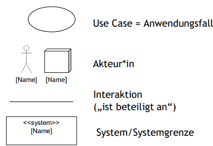
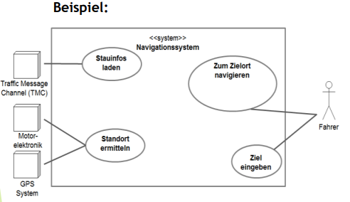
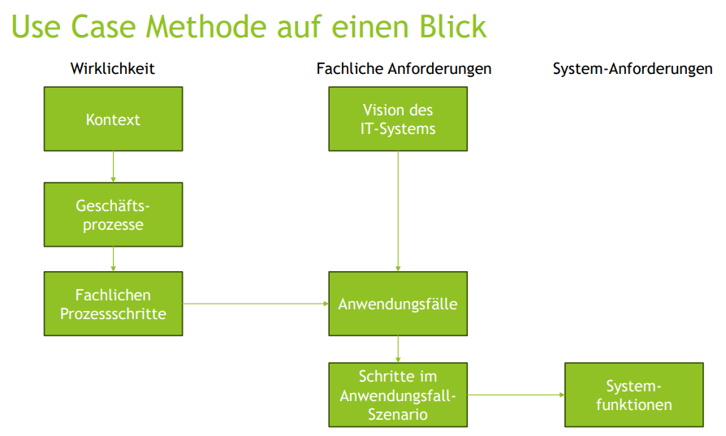

# Anwendungsfälle (Use Cases)
## Lernziele
### Sie wissen, was Anwendungsfälle sind und wie man sie zur Beschreibung funktionaler Anforderungen einsetzen kann.
- Ein Anwendungsfall beschreibt Schritt für Schritt, wie ein\*e Akteur\*in mit dem System interagiert, um ein Ziel zu erreichen.
- Zentrale Frage für die funktionalen Anforderungen ist: Was möchten die Akteure*innen mit dem System machen? -> Antwort in Form von Anwendungsfällen
- Ein Anwendungsfall erzählt eine Geschichte, wie ein\*e Akteur\*in das System einsetzt, um etwas Wertvolles zu erreichen.
- Ein Anwendungsfall beschreibt eine durchgängige Interaktion ohne (größere) Pausen.
- Use Case beschreibt Interaktion des Kontexts mit dem System
- Die einfachstmögliche Form der Beschreibung eines Anwendungsfalls,
zeigt nur den Titel und die Schritte (aus fachlicher Sicht)
- Anforderungen kann man anwendungsfallbasiert erarbeiten, d.h. man beginntdamit, herauszufinden, was die Anwender\*innen mit dem System machen möchten und leitet daraus dann die funktionalen Anforderungen und Qualitätsanforderungen (Eigenschaften) ab. (Dennoch müssen Anforderungen aus anderen Quellen ergänzt werden)

### Sie können Anwendungsfälle aus Prozessen und von Stakeholder*innen ermitteln.
#### Aus Prozess
- Wie läfut der End-to-End-Prozess ab und welche Schritte kann man durch Software unterstützen
- Checkliste zur Erarbeitung:
    - Wie heißt der Prozess?
    - Wie ist der Ablauf? (Tätigkeiten und Schritte)
    - Welche Akteur\*innen machen was?
    - Entscheidungen un deren Kriterien
    - Welche IT-Systeme werden wann eingesetzt?
    - Welche Daten als In- und Output?
- Wo kann Software die Akteur\*innen unterstützen?
- Was kann Software automatisiert übernehmen?
- Wo muss/kann der Prozess durch Software-Unterstützung vereinfacht oder verändert werden?

### Von den Stakeholder\*innen

- In Interviews Stakeholder\*innen direkt fragen:
    - Was möchtest Du mit dem System machen?
    - Kann das System dir Tätigkeiten abnehmen?
    - Kann man das nicht etwas anders angehen, sodass Software dich unterstützen kann?
- Dies eignet sich vor allem wenn:
    - Stakeholder\*innen ihre Anforderungen bereits sehr gut durchdacht haben.
    - Der Funktionsumfang der Software gut bekannt ist, z.B. bei Systemablösen
    - Die Stakeholder\*innen strukturiert denken und arbeiten können bzw. die Interviews/Workshops sehr gut moderiert werden.
- Achtung: Oft denken die Stakeholder\*innen nicht daran, dass sie auch für sie Selbstverständliches sagen müssen (Checklisten helfen).

### Sie können Use Case Diagramme einsetzen, um sich einen Überblick über Anwendungsfälle zu verschaffen.
Yes,

- Das Use Case Diagramm zeigt NICHT:
    - Reihenfolge, in der die Use Cases abgearbeitet werden
    - Priorität der Anwendungsfälle

### Sie können Anwendungsfälle detailliert mittels Use Case Description beschreiben.
- Für jeden Anwendungsfall im Use Case Diagramm gibt es eine Use Case Description.
- Folgende Attribute werden typischerweise zu einem Use Case spezifiziert:
    - Titel (Wie heißt der Use Case?)
    - Zweck (Wozu gibt es diesen Use Case?)
    - Ergebnis (Was fällt am Ende als Ergebnis raus?)
    - Szenarien (Hauptszenario, Alternativszenarien, Fehlerszenarien)
    - Zusatzinfos zu einzelnen Schritten
    - Vor- und Nachbedingungen
    - Hinweise für die Lösung
    - Hinweise fürs Testen
- Szenarien sind tricky zum Beschreiben, Tipps:
    - Wechselspiel zwischen Akteur\*innen und System beschreiben.
    - Mikro-Satzschablone „\<Akteur\*in\> \<Aktion\>“
    - Aktiv und im Präsens formulieren.
    - Lösungsneutral und in 4 - 20 Schritten beschreiben
- Auslöser sind Ereignisse (meist) außerhalb des Systems (im Kontext), die von einer\*einem Akteur\*in wahrgenommen werden und zum Starten eines Anwendungsfalls führen.

### Sie wissen, wie man funktionale Anforderungen und benötigte Systemfunktionen aus Anwendungsfällen extrahiert.
- Um die benötigten Funktionen des Systems zu ermitteln, geht man die Schritte
des Use Case nacheinander durch. Je nach Akteur\*in des Schrittes ist es:
    - Eine UI-Anforderung, wenn Akteur\*in eine Person ist
    - Eine Schnittstellen-Anforderung, wenn Akteur ein anderes System ist
    - Eine automatisierte Funktion, wenn Akteur das System selbst ist
- In der nächsten Verfeinerungsstufe werden danach die Funktionen detaillierter besprochen und verfeinert, z.B. mittels Semantischer Analyse, Checklisten ...

